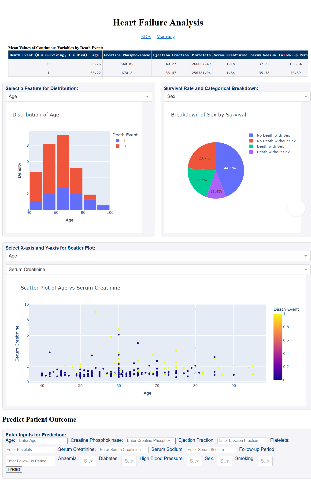

# Heart Failure Analysis



This repository contains an analysis and modeling of a dataset involving 299 patients who have experienced prior incidents of heart failure. The goal is to explore the dataset, build predictive models, and visualize the results to gain insights into heart failure prediction.

## Files

- `1_eda_jpg_2024-12-13.ipynb`: Exploratory Data Analysis (EDA) notebook.
- `2_modeling_jpg_2024-12-17.ipynb`: Development of a machine learning model for predicting heart failure outcomes.
- `3_dashboard_jpg_2025-01-06.py`: Web dashboard utilizing Dash for displaying the analysis.
- `heart_failure_predictor.pkl`: Saved model for heart failure prediction.

## Installation
1. Clone this repository:
   ```bash
   git clone https://github.com/saltyjared/heart-failure-analysis.git

2. Install required packages:
   ```bash
   pip install -r requirements.txt

## Usage
1. View and run the EDA/modeling notebooks in a Jupyter environment
2. Launch Dash dashboard with:
   ```bash
   python 3_dashboard_jpg_2025-01-06.py
   ```
   Available at `http://127.0.0.1:8050/`.
   
